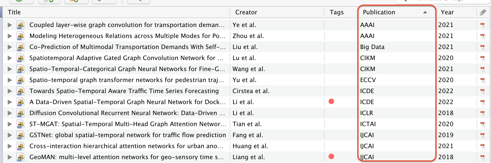
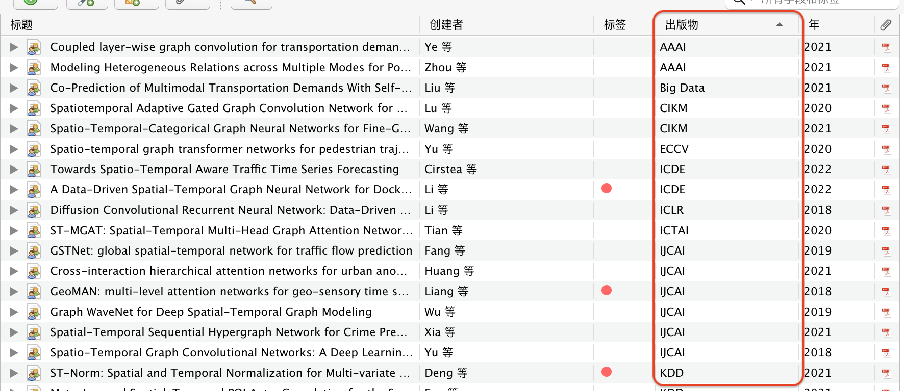

# Zotero Abbreviation for conference and journals

This is a plugin for [Zotero](https://www.zotero.org/), developed with 

这是[Zotero](https://www.zotero.org/)的一个插件，基于开发

## Examples

Automatically display the abbreviation for conferences and journals in the main pane, making it more readable.

## 样例

在主界面中显示会议或期刊的简称，使其更加易读

## Usage

1. Download the latest version (.xpi file) from release page on the right side of this website.
2. Open Zotero, `Tools` -> `add-ons` -> geer button on the top-right -> `Install Add-on From File`, select the .xpi file you just downloaded
3. Right click the column bar, click `Publication` in the drop-down menu and add it to the top column.
4. Select all items with `Ctrl+a`(Window/Linux) or `command+a`(MacOS), right click and click `Update Abbreviation`.
5. Enjoy it!

## 用法

1. 从release页面（网页右侧）下载最新的版本（xpi文件）
2. 打开Zotero，`工具` -> `附加组件` -> 右上角齿轮按钮 -> `Install Add-on From File`，选择刚下载的.xpi文件
3. 右键菜单栏，在下拉菜单中选择`出版物`
4. 使用`Ctrl+a`(Window/Linux)或者`command+a`(MacOS)全选所有项目，右键打开菜单，点击`更新出版物简称`
5. 搞定！

## Todo

Only support several conferences and journals in the field of computer science for now.

Preference panel is required for customized abbreviations.